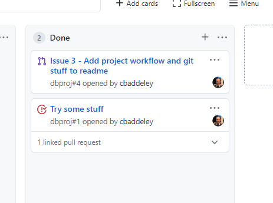

# dbproj

## Setup

1. Download Node https://nodejs.org/en/
2. Clone the repository
3. From the `db-proj-api` directory, run `npm install` to download all dependencies. To run the server, run `npm start`. Then as a test, open http://localhost:3000/api/v1/users in your browser and you should see the mock user data from the generated project template.
4. From the `db-proj-ui` directory, run `npm install` to download all dependencies. To run the application, run `npm start`. Then navigate to http://localhost:4200/.

## Git

###### Download Git

https://git-scm.com/downloads

###### Setup Your SSH Keys

https://docs.github.com/en/github/authenticating-to-github/connecting-to-github-with-ssh

###### Clone the Repo

https://github.com/cbaddeley/dbproj

###### Git Tutorial

https://git-scm.com/docs/gittutorial

###### Git GUIs 

http://gitextensions.github.io/

## Project Workflow

#### Create Issue

1. ##### Click on the New Issue button in the Issues tab

2. ##### Fill out the form. You don't need to assign it to anyone, but please **add DBProj to the Projects**

3. ##### Click on "Submit new issue" and confirm that issue is added to the project board

#### Start Working On Issue

1. ##### Create a local branch for development

2. ##### Move Issue to "In Progress"

3. ##### After the needful changes, create a commit and push to a remote other than main

#### Create a Pull Request

1. ##### Create a pull request under the Pull Requests tab. Please **add DBProj to the Projects**.

2. ##### Pull Request will be in review. Add to the conversation, review, make comments, approve, or request changes.

3. ##### Link to Issue

3. ##### After approval, merge the pull request.

4. ##### Pull request will then be moved to the Done column

5. ##### Delete the Remote Branch

#### Closing an Issue

1. ##### After all work is done. Close the issue from the Issues tab

2. ##### Confirm that the issue is in the Done column

## References

**node-oracledb** - https://oracle.github.io/node-oracledb/doc/api.html

**Express** - https://expressjs.com/en/guide/routing.html

**Angular** - https://angular.io/start'
